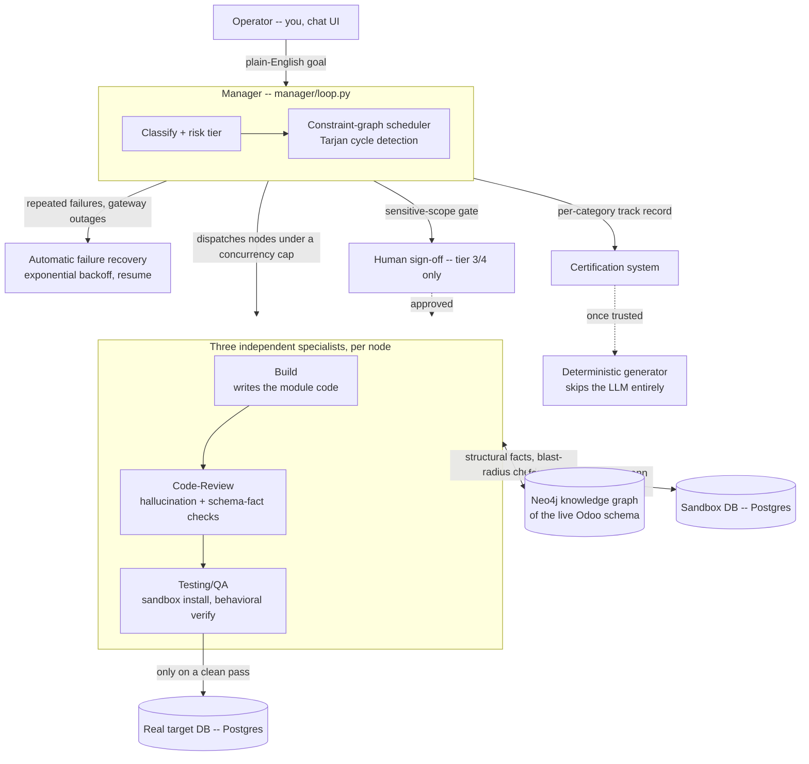

# OMA — Odoo Manager Agent

[](https://github.com/40chos/oma-portfolio/actions/workflows/ci.yml)
[](LICENSE)

A multi-agent system that takes a plain-English request ("add a field to
this model," "restrict this view to a security group") and turns it into a
real, installed Odoo ERP module change — writing the code, reviewing it,
installing it in an isolated sandbox, verifying the result independently,
and only then promoting it. A human-approval gate sits in front of anything
sensitive.

This is a from-scratch reimplementation of a system I built and ran in
production, ported — with my employer's permission — to a fully
self-hosted, open-source stack so anyone can run the real thing. All
client data, names, and proprietary code have been removed or replaced.
Every mechanism below — the scheduler, the fencing lock, the knowledge
graph, the three-specialist review pipeline, the certification system, the
failure-recovery logic — is the real, unmodified code, not a simplified
rewrite. Only the environment it talks to changed.

## See it work

**[→ Watch a real run replay](https://claude.ai/code/artifact/2aa5e7f5-bf07-4066-bdb5-af4ea9fcea0f)** —
a scrubbable flight-recorder timeline built from the actual trace of one
real execution: the request going in, classification, Build writing code
live (token by token), Code-Review and Testing/QA independently checking
it, and the real result — the real generated `models.py`/`views.xml` and
the real commit. No video, no slides — the real captured data, replayable
in your browser, free, forever, no server required.

<video src="docs/demo/full-task-walkthrough.mp4" controls width="100%"></video>

*Shared with employer approval: a real multi-node task completing on the
original production instance this repo is ported from — a genuinely
complex request split into 9 real pieces with real dependencies between
them, built, reviewed, and verified. This is the real production system,
not this repo's own sanitized demo instance, which is why it looks
different from (and has more history than) what `./setup.sh` gives you.*

`DECISIONS.md` is the full, honest log of every judgment call made during
this port — including the real bugs found by actually running it, not
just reading the code.

## How it's wired



## What's actually interesting here

- **A constraint-graph scheduler** (`manager/graph_scheduler.py`) that
  dispatches independent sub-tasks in parallel under a concurrency cap,
  respecting real dependency edges, with Tarjan's-algorithm cycle
  detection on the constraint graph. A genuinely complex request really
  does split into multiple first-layer nodes with real `blocked` ->
  `running` -> `passed`/`failing` transitions as pieces wait on each
  other — not a single flat task. See `DECISIONS.md` for a real example:
  one goal decomposed into 9 sub-contracts.
- **A fencing lock** (`infra/fencing.py`) implementing the Kleppmann
  distributed-lock fix — a monotonic fence token, not just a TTL'd lock,
  so a stale writer can never commit after losing its lock.
- **A real structural knowledge graph** of the target Odoo instance
  (modules/models/fields/views and their real relationships) in Neo4j,
  used to ground generation in real facts and catch cross-module
  "blast radius" collisions before a write happens.
- **Three independent specialists** — Build writes code, Code-Review runs
  an independent pass with dozens of hallucination-filtering checks
  against the live schema and knowledge graph, Testing/QA installs the
  result in a sandbox and verifies it behaviorally. Testing/QA never
  trusts Build's own claim of success.
- **A certification system** that tracks real reliability per
  request-category over time and gates whether a category is trusted
  enough to hand to a deterministic, non-AI generator instead of an LLM.
- **Automatic failure recovery** — detects LLM repetition loops,
  infrastructure outages, and gateway failures, and resumes paused work
  with exponential backoff, no human needed for routine transient
  failures.
- **A sandboxed, allow-listed execution model** — the system can only
  ever write to an explicitly allow-listed target, enforced in code
  (`infra/odoo_settings.py`'s `ProductionOdooGuardError`), never just
  convention.
- **Live, not after-the-fact** — the chat UI opens a task's live event
  stream (Server-Sent Events over Redis pub/sub) the instant the Manager
  mints its task_id, before any real work has happened, so you watch
  classification, node splits, and token-by-token code generation as they
  actually occur, not a summary after the fact.

## Run it yourself

Needs Docker (Desktop, or Colima/similar) and ~10GB free for images/models.
Everything runs on demand — nothing stays running permanently; this is
designed to come up for a session (a demo, an interview screen-share) and
tear down after.

```bash
git clone <this-repo>
cd oma-portfolio
./setup.sh
```

That's it. `setup.sh` brings up Postgres/Redis/Neo4j/Odoo CE/Gitea, waits
for everything to report healthy, provisions Gitea (org/repo/token) and
the two Odoo databases Build/Testing-QA actually write into, pulls and
starts a local LLM via Ollama (the default — free, fully self-hosted; set
`OMA_LLM_MODE=cloud` and `OMA_CLOUD_ESCALATION_API_KEY` in `oma/.env`
first if you'd rather use a cloud model), seeds the knowledge graph from
Odoo's own demo modules, and starts the app — printing the URL to open
when it's ready. Safe to re-run; every step checks whether it's already
done before doing it again.

Open `http://localhost:8000`, type a request (e.g. *"On res.partner, add a
field for a LinkedIn profile URL"*), and watch it classify, build, review,
test, and install — against a real Odoo CE instance with real demo data.

Verified end to end from a genuinely clean clone (fresh volumes, no prior
state) as part of this port — see `DECISIONS.md`, Stage 8.

### Recording your own demo from this repo's own instance

The video above is from the original production system this is ported
from. If you also want a clip of *this* repo's own sanitized, self-hosted
instance running (e.g. to prove the clone itself genuinely works, not just
describe it):

1. `./setup.sh`, open `http://localhost:8000`.
2. Start screen recording (macOS: Cmd+Shift+5; or any screen-to-GIF tool —
   Peek, ScreenToGif, Kap are all free).
3. Type a request with real structure, e.g. *"On res.partner, add a
   computed field showing the count of linked project tasks, and restrict
   editing it to the Sales Manager group"* — multi-part requests are what
   show the constraint-graph splitting, which is the actually interesting
   part to show, not a single trivial field.
4. Let it run ~20-30s: the Task Plan panel opens automatically and streams
   live — classification, node creation, Build's code streaming in
   token-by-token, Code-Review/Testing-QA's verdicts.
5. Stop recording once a node reaches `passed`. Trim to the live-streaming
   part — that's the part a static screenshot can't prove.

### Why no `app` container by default

The Build/Testing-QA specialists run `docker exec` against the sibling
`odoo` container (the direct replacement for the original's SSH-based
remote exec — see `DECISIONS.md`, Stage 5). Doing that from *inside* a
container means mounting the host's Docker socket into it, which grants
that container full control over the whole Docker daemon — a real
sandbox-escape-adjacent risk, and in tension with this project's own
"sandboxed, allow-listed execution" design. Running the app on the host
instead means `docker exec` is just the normal Docker CLI a developer
already has. A containerized `app` service is still in `docker-compose.yml`
for anyone who wants full containerization and is comfortable with that
tradeoff (`docker compose up -d app` — see its comment in that file).

## How it's organized

```
oma/                   the actual application (unchanged internal structure:
                        manager/, specialists/, contracts/, infra/, tools_odoo/)
oma/registry/          skills (odoo-module-scaffolding, odoo-codebase-audit, ...)
                        and the constitution every specialist checks its own work against
docker/                Compose support: Dockerfiles, entrypoints, Gitea/knowledge-graph
                        bootstrap scripts, the LiteLLM cloud-mode config
docs/                  the real-run replay page (GitHub Pages, served from here)
demo-capture/          the real captured trace the replay page is built from
.github/workflows/     CI — syntax + import validation on every push (see the
                        workflow file's own header comment for why it's scoped
                        this way, not a full integration-test run)
ARCHITECTURE.md        a deeper technical walkthrough than this README
DECISIONS.md           every judgment call made during the port, and why
```

**[→ ARCHITECTURE.md](ARCHITECTURE.md)** goes deeper than this README on how the
pieces fit together — the request lifecycle, the constraint-graph scheduler, the
three-specialist pipeline, and what this repo deliberately leaves out and why.

`oma/README.md` has the deeper per-module documentation (env vars,
specialist internals, the manager's autonomy-tier model in
`oma/MANAGER_CONSTITUTION.md`).

## Status

All 9 stages — infra, knowledge graph, LLM gateway, Git versioning, SSH
removal, full end-to-end wiring, final secret-scan + clean-clone
verification, a genuinely fresh-instance pass, and a live-streaming
architecture fix found by actually using the running system — are done.
`DECISIONS.md` has real evidence for each one: command output, real
database/Gitea state, and the real bugs found by actually running this
rather than just reading it. Gitleaks and TruffleHog both report zero
findings across the full git history.
